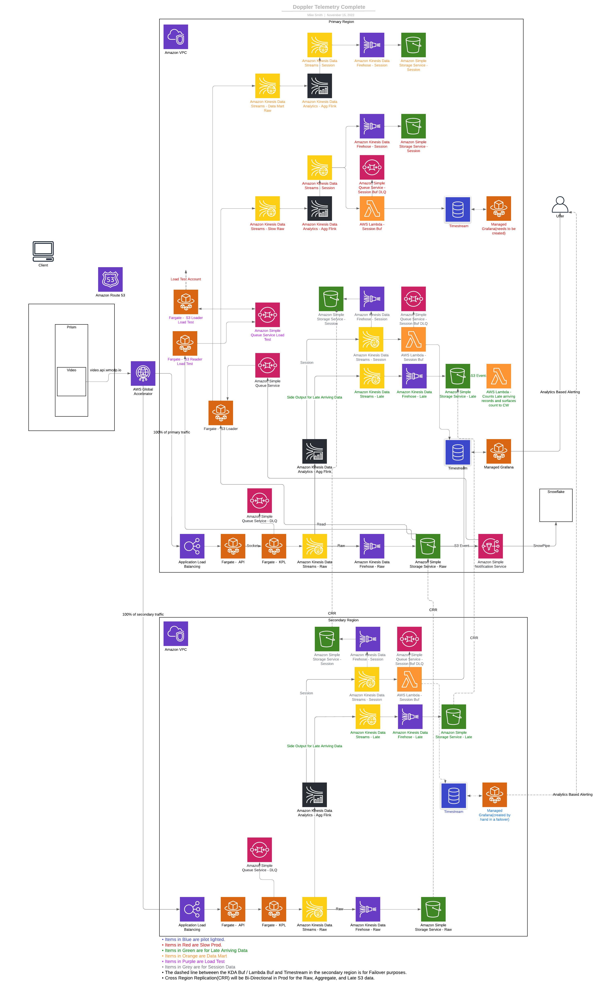

# IAC

## Arch Diagram

## Supported Regions

- Primary - us-east-1
- Secondary - us-west-2

## Environments

- Dev - development environment
- Data Mart - data mart environment
- Slow Prod - slow prod environment to allow testing of production data in separate environment
- Load Testing - allows us to fire data that lands in S3 to any environment in near real time.

## Special situations

- When we create a new environment with production level traffic using KDA, we will need to create a ticket with AWS to adjust the following items in Flink.
- **Please adjust the heartbeat.timeout and akka.ask.timeout to 300s. This will allow the busy taskManagers to reply in time. You will need to restart your application for the time outs to apply.**

## Resource Alerting

- [Alerting Detail](./alerting.md)

## Resource Dashboard

- [Dashboard Detail](./dashboard.md)

## Budget Dashboards

- [Budget Dashboards Detail](./budgetdashboard.md)

## Structure

### IAC

- base - [base readme](./base/README.md)
- env - [env readme](./env/README.md)
- modules - [modules readme](./modules/README.md)

## Workflow

- Video events flow from the prism video client using a JSON structure via an HTTPS request to an AWS Global Accelerator which directs the traffic to an Application Load Balancer in the region most close to the client.

- The request then flows to a Fargate task([http_handler readme](../code/fargate/http_handler)) that leverages a KPL sidecar container to publish events to Kinesis Data Streams(KDS).

- Once this Raw data lands in KDS, we have 2 consumers consuming the data from KDS.

- The first consumer is Firehose and it buffers and lands the data into the Raw S3 bucket in the region the KDS resides in.

- The second consumer is a KDA Flink job([agg readme](../code/kda/agg)) that does aggregations on the data and then sends it on to another 2 KDS(Session, and Late) using the KPL.

- Once the Session data lands in the Session KDS, we have another 2 consumers processing this data.

  - The first consumer is Firehose and it buffers and lands the data into the Session S3 bucket in the region the KDS resides in.

  - The second consumer is a Lambda function([session buf readme](../code/lambda/kds_timestream_buf_sess)) that receives events via the kinesis trigger and buffers the writes to the sessions Timestream table.

  - Once the data lands in Timestream we surface the sessions into Grafana where they can be viewed via a real time dashboard. We also are planning on creating real time alerts off of this data.

  - The data in S3 is replicated(via cross region replication) bi-directionally to allow for rapid recovery in the case of a failover. **There is a circular dependency in the current terraform code so s3 data is only being replicated from source(us-west-2) to destination(us-east-1). Replication from destination back to source can be manually setup by adding a rule in the us-east-1 S3 buckets management tab to replicate back to us-west-2.**

- Once the Late data lands in the Late KDS, we have another 1 consumer processing this data.

  - The consumer is Firehose and it buffers and lands the data into the Late S3 bucket in the region the KDS resides in.

  - The data in S3 is replicated(via cross region replication) bi-directionally to allow for rapid recovery in the case of a failover. **There is a circular dependency in the current terraform code so s3 data is only being replicated from source(us-west-2) to destination(us-east-1). Replication from destination back to source can be manually setup by adding a rule in the us-east-1 S3 buckets management tab to replicate back to us-west-2.**
