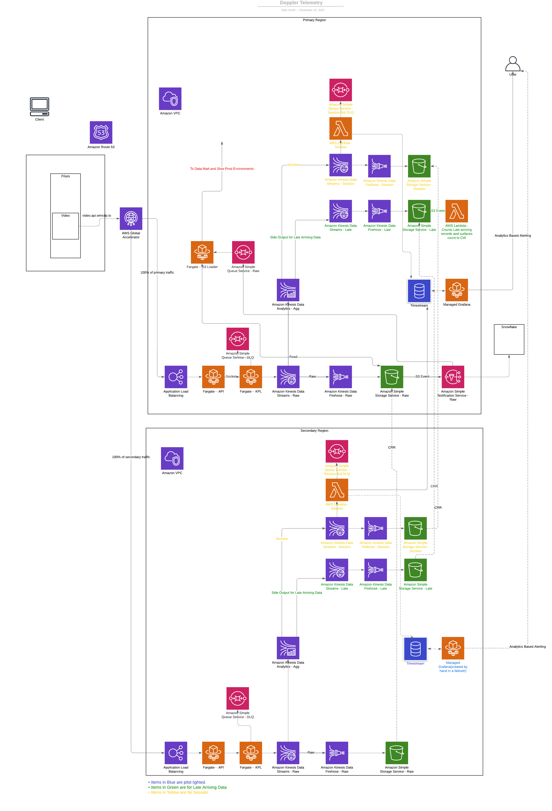

# dev - Development Environment Terraform

## Arch Diagram

/budget/ - The creates a budget based on the common tags used for all the resources. The \$ amount will need to be adjusted.  
main.tf - main entrypoint into environment tf  
provider.tf - provider info with alias for each additional region  
variables.tf - variables needed by stack  
versions.tf - controls versioning of terraform resources  
terrafrom.tfvars - variables set for an initial environment

variables are described in the parents README([variables readme](../README.md))

**This resides in us-east-1 and us-west-2**

**This stack will take a few minutes to create so please wait 3-5 minutes after its completed to verify resources are created. You should be able to do a terrafrom plan and have no updates once everything is done.**
